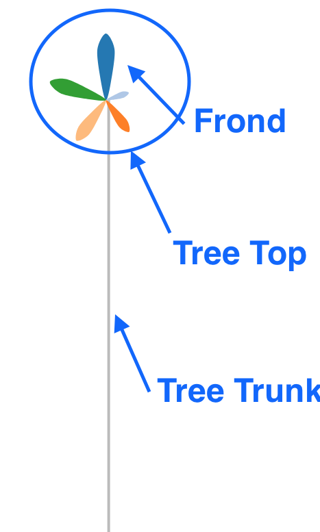

# rhtmlPalmTrees

R htmlwidget package for creating a palm tree plot

# Installation in R

## Important
This package uses a customised htmlwidget package that allows local state saving. The official htmlwidget package will not work. Download the customised package by running install_github('Displayr/htmlwidgets')

## Installation
1. `library(devtools)`
1. `install_github('Displayr/htmlwidgets')`
1. `install_github('Displayr/rhtmlPalmTrees')`

An example to verify installation:
```
library(rhtmlPalmTrees)

PalmTrees(data = matrix(seq(25), 5),
                  col.heading.font.size = 20,
                  col.font.size = 25)
```

# Developing / Contributing

## Local Installation for Development

**Prerequisites** - For help installing prerequisites see the `Prequisite Installation Help` section below

1. nodejs >= 6.0
1. python 2.7 - one of the nodejs libraries needs python during the installation process
1. yarn installed globally (can use npm to run, should use yarn to contribute)

## Installing the rhtmlPalmTrees code

1. On windows open git shell (or install it first). On OSX open terminal
    1. Tim note : Type enter when prompted for a passphrase when opening git shell
1. Change directory to the place where you put git projects
    1. Tim note : Do not use a Dropbox synced directory. There will be 1000's of files created by `npm install` and your computer will catch fire
1. type `git clone git@github.com:Displayr/rhtmlPalmTrees.git` ENTER
1. type `cd rhtmlPalmTrees` ENTER
1. type `npm install` ENTER
    1. `npm install` is noisy and will print several warnings about `UNMET` and `DEPRECATED`. Ignore these and only make note of errors. If it fails, try running it again.
1. type `gulp serve` ENTER
    1. If `gulp serve` does not work try `./node_modules/.bin/gulp serve`. To correct this and to make your nodejs life easier you should add `./node_modules/.bin` to your PATH. Consult the Internet for instructions on how to do so on your OS of choice. 
    1. Auto-reload will be enabled with `gulp serve`, meaning that any changes saved to the specific files in folders `scripts`, `internal_www` and `styles` inside the `theSrc` folder will trigger an automatic browser reload.
1. If you do not wish to have auto-reload enabled, run `gulp serve_s` instead.

If this worked, then the `gulp serve` command opened your browser and you are looking at `http://localhost:9000`. You should see a page listing a bunch of links to examples. These examples are defined in the [internal www content directory](theSrc/internal_www/content).

## Prerequisite Installation Help

### Install nodejs on OSX

1. Install brew by following instructions here : http://brew.sh/
1. Install nvm (node version manager) by running `brew install nvm`
1. Install node by running `nvm install 6.1.0` on the terminal

### Install nodejs on Windows

1. Setup nodist. https://github.com/marcelklehr/nodist and find the link to the official installer.
1. Open the command prompt. Type: `nodist v6.1.0`
1. Type `node -v` and verify the version is correct

### Python on OSX - it should come installed. If not

1. Install brew (if not done already) by following instructions here : http://brew.sh/
1. Install python by running `brew install python` on the terminal - make sure you get 2.7

### Python on Windows

1. Download version 2.7 from https://www.python.org/downloads/

## Developer Docs

rhtmlPalmtyrees relies heavily on [rhtmlBuildUtils](https://github.com/Displayr/rhtmlBuildUtils). You should read through the docs in the rhtmlBuildUtils repo to understand:
 
 1. which gulp tasks are available
 1. the constraints on file layout in your widget project
 1. How to perform visual testing.
 
 Here are a few important notes (both detailed in the rhtmlBuildUtils docs) you must keep in mind:

1. The last thing you do before committing is run `gulp build` to ensure all the autogenerated files are up to date.
2. (With some exceptions) ONLY EDIT THINGS IN these directories: `theSrc`, `bdd`, `docs`, and sometimes `build` !! Many of the other files are auto generated based on the contents of `theSrc`. As an example, if you edit `R/rhtmlTemplate.R` and then run `gulp build` your changes will be DELETED FOREVER!, because `R/rhtmlTemplate.R` is just a copy of `theSrc/R/htmlwidget.R`. See [htmlwidget_build_system](docs/htmlwidget_build_system.md) for more details.

## How the git prepush hook works (aka: My git push got rejected ?!)

This project uses the npm [husky](https://github.com/typicode/husky) module to add git lifecycle hooks to the project. These are defined in the `scripts` section of the [package.json](./package.json) file.
 
Of particular interest is the `prepush` entry which runs a script that checks the project code style using the `gulp lint` command. If there are errors, then it will reject your git push command. You have two options:
  
1. Fix the errors and try pushing again. To see which errors are in the code run `gulp lint`. To autofix as many as possible run `gulp lint --fix`; this will only report the errors it could not auto-fix. Don't forget to commit your code again before pushing.
1. If you must (not recommended) add a --no-verify (i.e., `git push origin head --no-verify`) to skip the style checking.

Here is an illustrative sequence:

```bash
$ git push origin head

> husky - npm run -s prepush

...

/Users/kyle/projects/numbers/rhtmlTemplate/bdd/steps/loadThePage.steps.js
  8:47  error  Missing semicolon  semi

✖ 1 problem (1 error, 0 warnings)

[17:50:09] 'lint' errored after 4.85 s

...

$ gulp lint --fix
[17:50:16] Starting 'lint'...
[17:50:21] Finished 'lint' after 4.94 s

$ git commit -a -m 'fix the style'
...

$ git push origin head
```

## Developing and Contributing

1. Do not work in master, as the master branch of rhtmlTemplate is used to verify the R server build process.
1. Create a branch, make some changes, add test for your changes, update the docs if necessary, push your branch, and create a pull request on github.

### Concerns / TODOs

* BDD: test north / east / west tooltips (only south is tested)
* BDD: test multiple calls to renderValue
* BDD: test that when i disable a frond, the sort order sometimes changes
* labelUtils: duplicated from heatmap : extract into shared component
* theSrc/scripts/components/parts: duplicated from heatmap : extract into shared component

### Terminology Notes

#### Palm Tree Anatomy



#### Sidebar Anatomy


